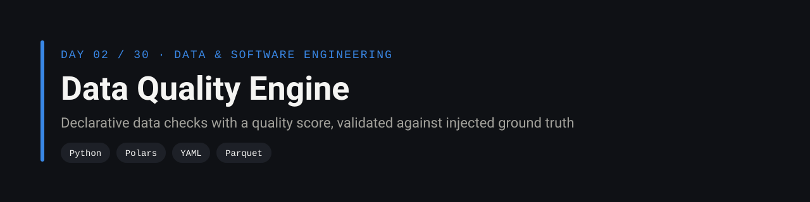
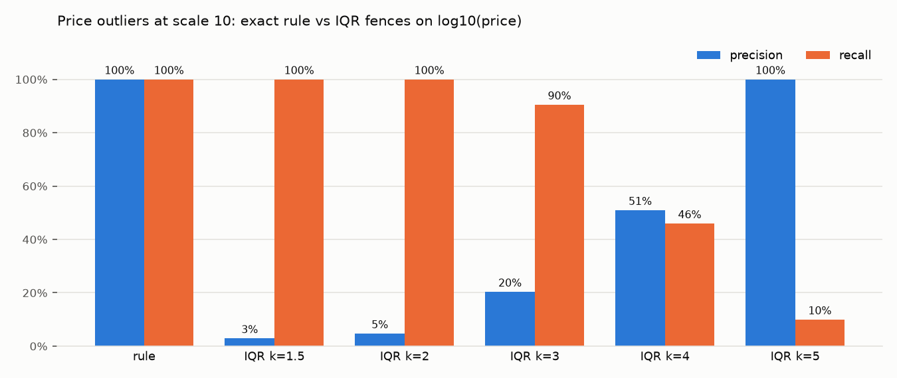
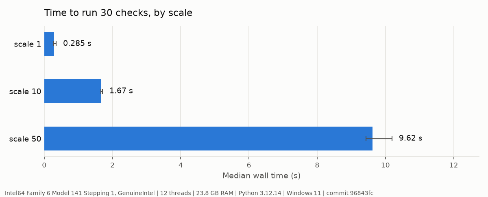

<p align="center">
  
</p>

<p align="center">
  <a href="https://github.com/silvano-moraes-de-souza/data-quality-engine/actions/workflows/ci.yml"></a>
  
  
  
  <a href="https://github.com/silvano-moraes-de-souza/30-days-data-eng"></a>
</p>

> Data checks declared in YAML, a weighted quality score, and an exit code that stops a pipeline when an error-level rule breaks. Instead of being judged by eye, the engine is scored against data where every injected problem was counted.

<table>
<tr>
<td align="center"><b>6 / 6</b><br/>injected problem types found<br/>with the exact row count</td>
<td align="center"><b>19.5M rows</b><br/>30 checks in 9.6 s<br/>(median of 3)</td>
<td align="center"><b>100% vs 20%</b><br/>precision of the business rule<br/>vs statistical outliers (k=3)</td>
<td align="center"><b>20 tests</b><br/>98% coverage</td>
</tr>
</table>

<sub>All numbers come from <a href="bench/run.py">bench/run.py</a> and <a href="results/">results/</a>.</sub>

**Contents:** [Problem](#problem) · [What it checks](#what-it-checks) · [Quickstart](#quickstart) · [Results](#results) · [How it works](#how-it-works) · [Engineering decisions](#engineering-decisions) · [Tests](#tests) · [Limitations](#limitations)

## Problem

A pipeline that loads bad data does not crash. It loads it, and the error surfaces weeks later in a dashboard someone trusted. Quality checks catch that, but they are usually evaluated by eye: a check "looks like it works" on a sample. There is rarely a way to say how many of the real problems it finds and how many alarms are false.

[shopflow-datagen](https://github.com/silvano-moraes-de-souza/shopflow-datagen), the shared dataset of this series, has a dirty mode that injects nulls, duplicates, price outliers, orphan keys and a schema change, and records exactly how many rows of each it wrote. That makes it possible to score a quality engine the way a model is scored.

## What it checks

```
DATA QUALITY SCORE

████████████████░░░░ 82%

Rows analyzed                394,856
Tables / columns            5 / 38
Checks                            30  (23 pass, 3 warn, 4 fail)
Null violations                  999
Duplicate rows                   505
Orphan references                175
Schema drift rows             20,101
Value mismatches                 160
Statistical outliers           1,109
Elapsed                        0.32s

STATUS: FAIL
```

<sub>Real output for shopflow-datagen at scale 1, dirty mode. Full per-check report: <a href="docs/sample-report.md">docs/sample-report.md</a>.</sub>

| Check | Finds | Example from [`rules/shopflow.yml`](rules/shopflow.yml) |
|---|---|---|
| `schema` | files with missing or unexpected columns | `columns: [order_id, customer_id, ...]` |
| `not_null` | nulls, optionally only where a condition holds | `delivered_at` must be set only when `status` is delivered or returned |
| `unique` | rows beyond the first per key | `order_id` |
| `foreign_key` | values with no match in another table | `order_items.product_id → products.product_id` |
| `accepted_values` | values outside a domain | `status in [pending, shipped, delivered, canceled, returned]` |
| `range` | values below a minimum or above a maximum | `quantity` between 1 and 100 |
| `matches_reference` | values that differ from a reference table for the same key | line price must equal the product's list price |
| `outlier_iqr` | values outside Tukey's fences, optionally on a log scale | `unit_price_cents`, k = 3 |

Every check has a severity (`error` or `warn`) and an optional `max_ratio` tolerance. The run fails, and the CLI exits with 1, only when an error-level check breaks.

## Quickstart

```bash
uv sync
uv run shopflow-datagen --scale 1 --out data/sf1-dirty --dirty
uv run dq-engine check data/sf1-dirty --rules rules/shopflow.yml
uv run dq-engine check data/sf1-dirty --rules rules/shopflow.yml --json report.json --md report.md
uv run dq-engine evaluate data/sf1-dirty --rules rules/shopflow.yml   # score against ground truth
uv run pytest
```

With Docker:

```bash
docker build -t dq-engine .
docker run --rm -v "$PWD/data:/data" dq-engine check /data/sf1-dirty --rules rules/shopflow.yml
```

## Results

Measured with [`bench/run.py`](bench/run.py) on a laptop (Intel Tiger Lake-H, 6 cores / 12 threads, 23.8 GB RAM, Windows 11), 1 warmup and 3 timed runs. Raw numbers in [`results/`](results/).

### Accuracy against injected ground truth

| Injected problem | Check | Scale 1: injected / found | Scale 10: injected / found |
|---|---|---:|---:|
| null emails | `not_null(customers.email)` | 211 / 211 | 1,988 / 1,988 |
| null channels | `not_null(orders.channel)` | 788 / 788 | 8,990 / 8,990 |
| duplicated orders | `unique(orders.order_id)` | 505 / 505 | 4,921 / 4,921 |
| orphan product ids | `foreign_key(order_items.product_id)` | 175 / 175 | 1,697 / 1,697 |
| prices x100 | `matches_reference(order_items.unit_price_cents)` | 160 / 160 | 1,789 / 1,789 |
| drifted rows (column renamed) | `schema(orders)` | 20,101 / 20,101 | 100,499 / 100,499 |
| nulls inside the renamed column | none: the column is outside the contract | 189 / - | 991 / - |

The last row is deliberate. In the drifted file `channel` became `sales_channel`, which is not in the contract, so no null rule applies to it; those rows are already flagged by the schema check.

This evaluation also found a bug in the ground truth itself. The first version of shopflow-datagen reported 975 null channels, but the engine found 788. The generator counted nulls before duplicating rows (duplicates copy their nulls) and before the drifted file renamed the column (189 nulls moved to `sales_channel`). 788 + 189 = 977 = 975 + 2 duplicated null rows. The counting was fixed in [shopflow-datagen](https://github.com/silvano-moraes-de-souza/shopflow-datagen/commit/10830d4).

### Business rule vs statistics for price outliers

Clean shopflow data always sells a line at the product's list price (an invariant tested in shopflow-datagen), so any line whose price differs from the list price is an injected error. That gives row-level truth to measure a statistical detector against the exact rule, at scale 10 (1.7 million order lines, 1,789 bad prices):

| Method | True positives | False positives | Missed | Precision | Recall |
|---|---:|---:|---:|---:|---:|
| `matches_reference` (list price) | 1,789 | 0 | 0 | 100% | 100% |
| IQR on log10(price), k = 1.5 | 1,789 | 59,921 | 0 | 2.9% | 100% |
| IQR, k = 2 | 1,789 | 36,147 | 0 | 4.7% | 100% |
| IQR, k = 3 | 1,619 | 6,337 | 170 | 20.3% | 90.5% |
| IQR, k = 4 | 822 | 791 | 967 | 51.0% | 45.9% |
| IQR, k = 5 | 178 | 0 | 1,611 | 100% | 9.9% |



No value of k gets both. Real prices are heavy tailed (an expensive notebook is legitimate), so wide fences miss errors and narrow ones flag the catalog's expensive items. On clean data the k = 3 check still flags 969 rows at scale 1. That is why `outlier_iqr` is a warning in the rule file and the list-price rule is an error: when a business rule exists, it beats a distribution.

### Runtime

| Scale | Rows | Median | Min / max | Rows per second | Peak RSS |
|---:|---:|---:|---:|---:|---:|
| 1 | 394,856 | 0.29 s | 0.27 / 0.35 s | 1.38M | 487 MB |
| 10 | 3,920,084 | 1.67 s | 1.66 / 1.71 s | 2.35M | 1,052 MB |
| 50 | 19,556,822 | 9.62 s | 9.43 / 10.19 s | 2.03M | 1,758 MB |



30 checks over 19.5 million rows in under 10 seconds, single process.

## How it works

**Reading.** Each table folder (`<table>/part-*.parquet` or `.csv`) is scanned lazily with Polars. Part files are concatenated diagonally, so files with different columns (schema drift) still load, and each row carries the name of its file in a `_part` column. A check on column `x` only looks at rows from files that have `x`. Without that, the 20,101 drifted rows would show up as 20,101 null channels, and one problem would be reported twice under the wrong name.

**Checking.** Each check turns into a Polars query that counts failing rows and keeps up to 5 sample values: an anti join for foreign keys, `is_duplicated` for uniqueness, an inner join and a comparison for `matches_reference`, quantiles for the IQR fences.

**Scoring.** Error-level checks weigh 3 and warnings 1. The score is the weighted share of passing checks. Status is FAIL if any error check fails, WARNING if only warnings do, PASS otherwise.

**Evaluating.** `dq-engine evaluate` maps each problem in shopflow-datagen's `_manifest.json` to the check that should catch it and compares counts, then computes precision and recall of the IQR fences for several values of k.

## Engineering decisions

| Decision | Alternatives | Reason |
|---|---|---|
| Rules in YAML, engine in code | Great Expectations, Soda, dbt tests | Those are the right choice in production. Building the engine shows what they do underneath: how drift, nulls and joins interact, and why severity and tolerance matter. |
| Polars lazy frames | pandas | Lazy scans read only the needed columns, and joins and aggregations run multi-threaded: 2M rows per second here. |
| Track the source file of each row | Treat a missing column as nulls | Keeps schema drift and null violations apart, so each problem is reported once, by the right check. |
| Severity plus tolerance | Pass or fail only | Not every rule is worth stopping a pipeline for. Statistical outliers are a warning, broken keys are an error. |
| Exit code 1 on error | Report only | The engine can gate a load in CI or in an orchestrator without extra glue. |
| Score against injected ground truth | Eyeball a sample | Gives exact counts and precision/recall, and it caught a counting bug in the generator itself. |

## Tests

20 tests, 98% coverage:

| Test | What it proves |
|---|---|
| rule parsing | malformed files fail with a clear message (missing type, unknown check, bad severity, no column) |
| each check on hand-made data | exact counts and samples for schema drift, conditional not_null, unique, foreign key, accepted values, range, matches_reference, IQR |
| severity and tolerance | warn vs fail, `max_ratio`, missing columns reported as failures |
| clean shopflow data | no error-level check fails |
| dirty shopflow data | all 6 covered problems found with the exact count |
| rule vs statistics | loose fences catch everything but are mostly false alarms; tighter fences trade recall for precision |
| reports and CLI | text, Markdown and JSON output; exit codes 0 on clean, 1 on dirty, 2 without ground truth |

CI runs the tests on Python 3.11, 3.12 and 3.13, then builds the Docker image and runs the engine inside it: clean data must pass and dirty data must fail the gate.

## Limitations

- Each check scans the data again. At scale 50 that means 1.8 GB of peak memory; batching checks per table into one query would cut both time and memory.
- The IQR check computes quantiles over the whole column; outliers within a category (an expensive book vs an expensive notebook) would need grouped fences.
- No history: a run does not compare itself with the previous one, so a slowly rising null rate goes unnoticed. Trends and alerting are day 11.
- Rules cover structure and values, not freshness or volume (a table that stopped growing).

## Project structure

```
src/data_quality_engine/
  dataset.py     lazy reading, drift-aware concatenation
  rules.py       YAML rule parsing and validation
  checks.py      the eight check types
  engine.py      runs checks, computes score and status
  report.py      terminal, Markdown and JSON output
  evaluate.py    ground truth comparison, precision/recall of IQR
  cli.py         dq-engine command
rules/shopflow.yml   contract and rules for the shopflow dataset
bench/               benchmark scripts
results/             raw benchmark JSON
docs/                sample report and charts
```

## Part of the series

Day 02 of [30 Days of Data & Software Engineering](https://github.com/silvano-moraes-de-souza/30-days-data-eng). Previous: day 01, [ecommerce-data-pipeline](https://github.com/silvano-moraes-de-souza/ecommerce-data-pipeline). Next: day 03, Incremental ETL / CDC.

## Author

Silvano Moraes de Souza · [GitHub](https://github.com/silvano-moraes-de-souza) · [Portfolio](https://silvanomsouza.vercel.app/) · [LinkedIn](https://www.linkedin.com/in/silvano-moraes-de-souza)
